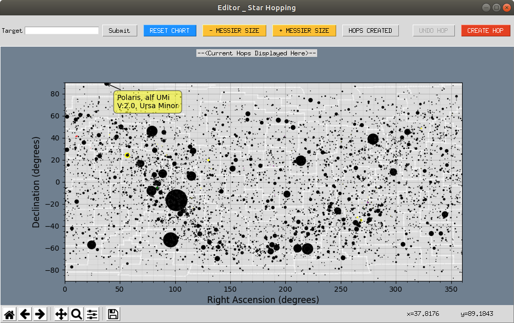

# Interface

Target text field takes the values of Right Ascension, Declination and Field of View in degrees; all seperated by spaces OR common name, messier ID, etc.. In the case of latter, a fixed FoV of 20 degrees is used to narrow down the plot.
  
RESET CHART will reset the plot to what it was initially on opening the interface.
  
MESSIER SIZE buttons will either increase or decrease the size of all messier objects; increments have no limit but the decrease button will not have affect once the size reaches the initial value.
  
HOPS CREATED button will display the list of messiers for whom hops have been created; this includes the ones from previous sessions.
  
CREATE HOP will prompt user to enter messier ID to which hops are to be made; prompt reappears if the object is unidentified. Once the messier ID is resolved it appears in the region above the plot indicating that the user can start creating hops.
 *Entering a messier ID in the prompt following the CREATE HOP button will not change map; Target text field or the navigation buttons are to be used to narrow on the messier object.*
 UNDO HOP will delete the last marker star in the current hop; can be used till all marker stars are deleted.
 FINISH HOP will prompt user for *Further Instruction* nad then the hops along with string input will be saved in the dictionary and the dictionary is pickled.
 *If FINISH HOP is clicked without recording any marker stars, an empty list is assigned to that particular messier object in the dictionary; If the particular messier already had hops in the dictionary, it will be overwritten now with an empty list(This is a method to clear existing hops).*
 
 A seperate program will form a csv from the dictionary. The messiers with empty lists will be disregarded at this juncture.

**Data files required for this Interface can be downloaded by running the program in the link**
[Data file](https://github.com/SahyadriDK/Hopping/tree/master/Program)
 **Download interface file from**
[Editor Interface](https://github.com/vvkrddy/Star-Hopping/blob/vvkrddy/editor_interface.py) 

# Instructions for Creating Hops for Messiers After clicking on CREATE HOP
Messier ID is entered; hops must be recorded in the order towards the messier object minus the messier object.
 So, if a star A and Star B are selected; the hopping is from A to B to Messier Object.
 
**CAUTION: EVERYTIME YOU NOTICE AN UNWANTED HOP IN THE DISPLAY ABOVE THE PLOT, CLICK UNDO. THIS HAPPENS ESPECIALLY  WHILE ZOOMING/PANNING USING THE DEFAULT NAVIGATION BUTTONS AS THEY TOO ARE RECORDED AS MOUSE CLICKS.
NEXT UPDATE SHOULD SEE A CHANGE IN THIS BEHAVIOUR.**
  
**ANY DEVIATION IN THE BEHAVIOUR OF PROGRAM FROM WHAT'S DESCRIBED, LET ME KNOW**
